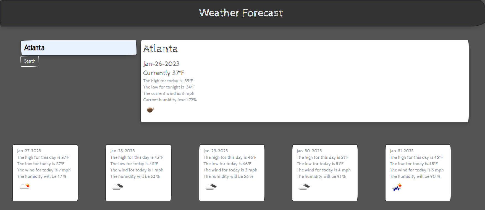

# ***Weather Forecast Dashboard***

## *Description*
Using third-party APIs, this *Weather Forecast Dashboard* is designed to show the functionality of making specific calls through the Open Weather Map API, and dynamically change the HTML page to thematically show the future weather for the city of the user's choice as well as showing the current weather for the city.

## *Instructions for Use*
To access the full functionality of this *Weather Forecast Dashboard*, simply type in the name of a city in the search bar, and click the search button.  Once done, the user will see the current weather in the large container to the right of the search bar, as well as the next five days in cards that will generate automatically below the search bar and the container showing the current weather.  

## *Table of Content*
[Resources](#resources)    
[Visuals](#visuals)     
[Live Link](#live-link)     
[Contact](#contact)     

## *Resources*

* [DayJS](https://day.js.org/)    
* [5 Day Weather Forecast](https://openweathermap.org/forecast5)

## *Visuals*

## *Live Link*

[Deployed Site](https://jjray84.github.io/Weather-Forcast/)

## *Contact*

[GitHub](https://www.github.com/jjray84/)
